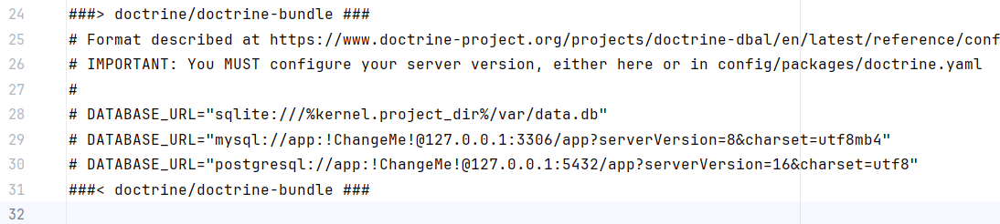

# Noir Pizza — A Noir-Style Pizzeria

## Description
Noir Pizza is a minimalist pizzeria website in noir style, built with Symfony, Inertia.js, Vite, Vue.js, and Tailwind CSS. As a study task for Intaro Incubator project.

## Installation
1. Clone the repository:
   ```bash
   git clone https://github.com/evanh-shumakov/hello-inertia.git
   ```
   ```bash
   cd hello-inertia
   ```

2. Install dependencies:
   ```bash
   composer install
   ```
   ```bash
   npm install
   ```

3. Configure the `.env` file for database connection:
   ```bash
   cp .env.example .env
   ```
   
   It's supposed you use database of your choice, and you set it by yourself. 


4. Run database migrations:
   ```bash
   php bin/console doctrine:migrations:migrate
   ```

5. Seed the database:
   ```bash
   php bin/console doctrine:fixtures:load
   ```

6. Build the frontend assets:
   ```bash
   npm run dev
   ```
   
7. Start the local server:
    ```bash
   symfony server:start
   ```
   
8. Open the website in a browser:
    ```
    http://localhost:8000
    ```